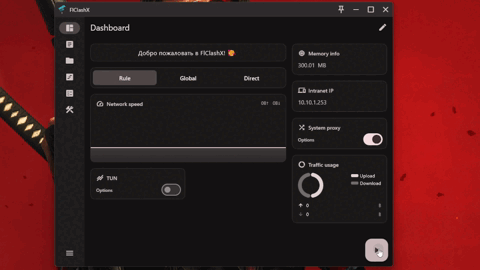
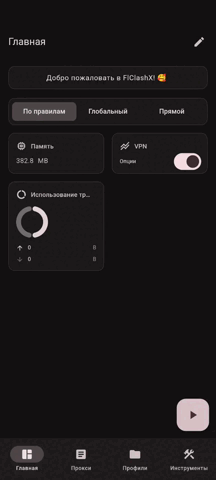

<div>

[**Russian**](README.md)

</div>

## FlClashX

[](https://github.com/pluralplay/FlClashX/releases/)
[](https://github.com/pluralplay/FlClashX/releases/)
[](LICENSE)

[](https://t.me/FlClash)

A fork of the multi-platform proxy client FlClash based on ClashMeta, simple and easy to use, open source and ad-free.

on Desktop:
<p style="text-align: center;">
    
</p>

on Mobile:
<p style="text-align: center;">
    
</p>

## Added Functionality:

🛠️ Fixed default settings: process search mode on, TUN mode on, system proxy mode off, proxy list display mode set to 'list', changed camera behavior when adding a subscription via QR.

🇷🇺 Added Russian language to the installer and redesigned the localization in the application.

✈️ Transmit HWID to the panel (Works only with <a href="">Remnawave</a>).

💻 Added a new "Announcements" widget. It transmits announcements from the panel to the widget. (Works only with <a href="">Remnawave</a>).

📺 Optimized controls for Android TV.

+ Added a "Paste" button to the menu for adding a subscription via a link.

+ Added a profile selection button.

+ Added the ability to transfer a profile from the mobile app via a QR code.

🪪 Redesigned the profile card:

+ Used traffic amount with a color-changing traffic bar (not displayed if traffic is unlimited).

+ Subscription expiration date (if the year is 2099, it displays "permanent subscription").

+ Added a new "Support" button in the profile, which pulls the supportUrl from the panel.

+ The autoupdateinterval for the profile is now correctly transmitted from the panel.

🌐 Added parsing of custom headers from the subscription page:

+ flclashx-widgets: arranges widgets in the order received from the subscription.
| Value  | Name widget |
| :---: | ------------- |
| `announce`  | Announce Badge  |
| `networkSpeed`  | Network speed |
| `outboundModeV2`  | Proxy mode (new type)  |
| `outboundMode`  | Proxy mode (old type)  |
| `trafficUsage`  | Traffic usage  |
| `networkDetection`  | Determining location and IP  |
| `tunButton`  | TUN button (Desktop only)  |
| `vpnButton`  | VPN button (Android only)  |
| `systemProxyButton`  | System Proxy Button (Desktop only)  |
| `intranetIp`  | Local IP-Address |
| `memoryInfo`  | Memory usage  |
| `metainfo`  | Profile information  |


Usage:
```bash
    flclashx-widgets: announce,metainfo,outboundModeV2,networkDetection
```
   + flclashx-view: Configures the appearance of the proxy page obtained from the subscription.

| Value  | Description | Possible values |
| :---: | ------------- | ------------- |
| `type`  | Display mode  | `list`,`tab` |
| `sort`  | Sorting type	  | `none`,`delay`,`name`|
| `layout`  | Layout  | `loose`,`standard`,`tight` |
| `icon`  | Icon style (for list display)  | `none`,`standard`,`icon` |
| `card`  | Card size   | `expand`,`shrink`,`min` |


Usage:
```bash
    flclashx-view: type:list; sort:delay; layout:tight; icon:standard; card:shrink
```

   + flclashx-custom: Controls the application of styles for Dashboard and ProxyView.

| Value  | Description |
| :---: | ------------- |
| `add`  | Styles are applied only when the subscription is first added  |
| `update`  | 	Styles are applied every time the subscription is updated |

Usage:
```bash
    flclashx-custom: update
```
   + flclashx-denywidgets: When set to true, editing the Dashboard page is disabled. Accepts true/false.

Usage:
```bash
    flclashx-denywidgets: true
```

## Application Usage

### Linux
⚠️ Before use, ensure the following dependencies are installed:
   ```bash
    sudo apt-get install libayatana-appindicator3-dev
    sudo apt-get install libkeybinder-3.0-dev
   ```
### Android
The following actions are supported:
   ```bash
    com.follow.clashx.action.START
    
    com.follow.clashx.action.STOP
    
    com.follow.clashx.action.CHANGE
   ```


## Download
<a href=""></a>

## Star
<p style="text-align: center;">
The easiest way to support the developers is to click the star (⭐) at the top of the page.<br>
If you want to support with a small donation, you can <a href="">do so here.</a>
</p>

**TON USDT:** `UQDSfrJ_k1BdsknhdR_zj4T3Is3OdMylD8PnDJ9mxO35i-TE`
